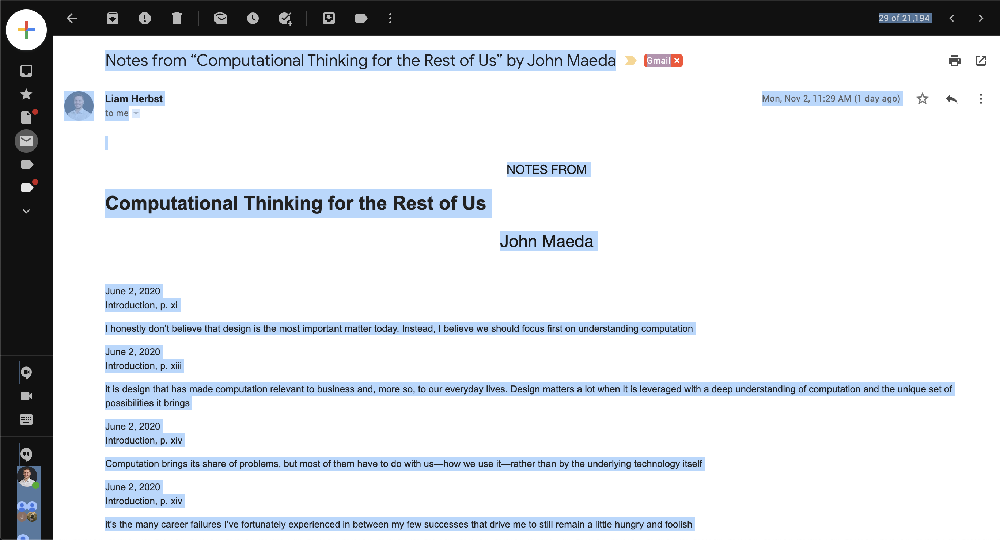

# Ebook Highlight Converter
The Ebook converter is a simple program for converting ugly iBooks and Kindle highlights into a pretty HTML file. The file can be viewed on the web or in a note taking application such as Notion.

# How to Use:
**You must you run the corresponding file for the type of notes (iBooks or Kindle) you've imported.**

## iBook Exports
### 1. Clone this Repository (i.e. Folder of files) from Github:
1. If you're new to Github, you can follow [this tutorial](https://docs.github.com/en/free-pro-team@latest/github/creating-cloning-and-archiving-repositories/cloning-a-repository) to learn how to download this folder to your system. 
2. You'll also need to have a text editor installed for simplicity. I recomommend installing [Virtual Studio Code](https://code.visualstudio.com/download) and installing the [Python extension](https://marketplace.visualstudio.com/items?itemName=ms-python.python) for running the file.
### 2. Copy, Paste & Save Your Notes
1. Open your email export and hit 'command + a' ('control + a' for PC users) to select your entire notes. 

2. Navigate to the 'paste_highlights_here.txt' file in the folder you download from part 1 and past your notes

3. Hit 'command + s' ('control + s' for PC) to save the updated 'paste_highlights_here.txt' document

### 3. Run the Code & Open Your Newly Formatted Notes
1. Navigate to the 'ibooks_converter.py' file and click the green triangle/arrow in the upper right-hand corner. Your highlights will convert to a nicely formatted HTML file.

2. Navigate to the original download folder and click the file to open

3. View your mint hightlight export

4. (Optional) Upload your notes into Notion (or another note taking application) by clicking import file, selecing HTML and selecting your file

## Kindle Exports
### 1. Clone this Repository (i.e. Folder of files) from Github:
1. If you're new to Github, you can follow [this tutorial](https://docs.github.com/en/free-pro-team@latest/github/creating-cloning-and-archiving-repositories/cloning-a-repository) to learn how to download this folder to your system. 
2. You'll also need to have a text editor installed for simplicity. I recomommend installing [Virtual Studio Code](https://code.visualstudio.com/download) and installing the [Python extension](https://marketplace.visualstudio.com/items?itemName=ms-python.python) for running the file.
### 2. Copy, Paste & Save Your Notes
1. Open your email export and hit 'command + a' ('control + a' for PC users) to select your entire notes. **If you opt not to use 'command + a' and select lines manually, make sure you select all lines (including the first line, 'Notebook Export').**

2. Navigate to the 'paste_highlights_here.txt' file in the folder you download from part 1 and past your notes

3. Hit 'command + s' ('control + s' for PC) to save the updated 'paste_highlights_here.txt' document

### 3. Run the Code & Open Your Newly Formatted Notes
1. Navigate to the 'ibooks_converter.py' file and click the green triangle/arrow in the upper right-hand corner. Your highlights will convert to a nicely formatted HTML file.

2. Navigate to the original download folder and click the file to open

3. View your mint hightlight export

4. (Optional) Upload your notes into Notion (or another note taking application) by clicking import file, selecing HTML and selecting your file

Thank you for reading! I hope you find this program helpful. If you have any feedback on how it can be improved, or would like to see some of the other projects I'm working on, follow me on Twitter [@liamherbst29](https://twitter.com/liamherbst29)
